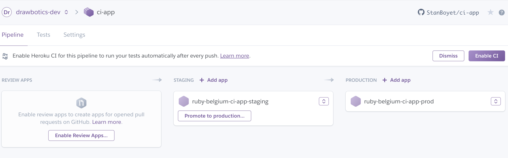
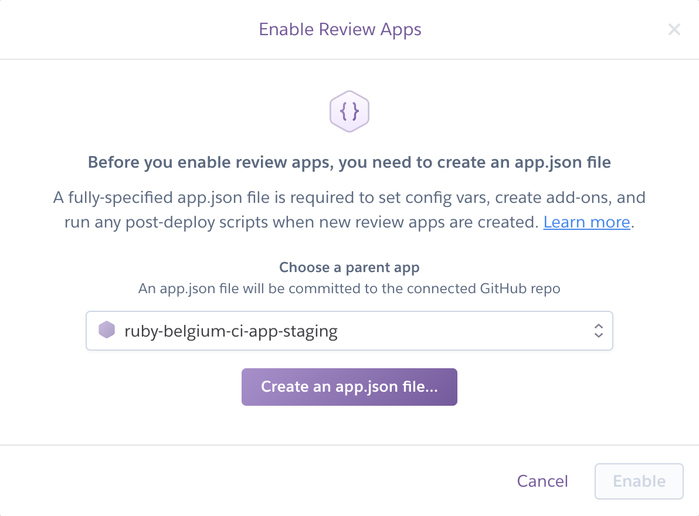
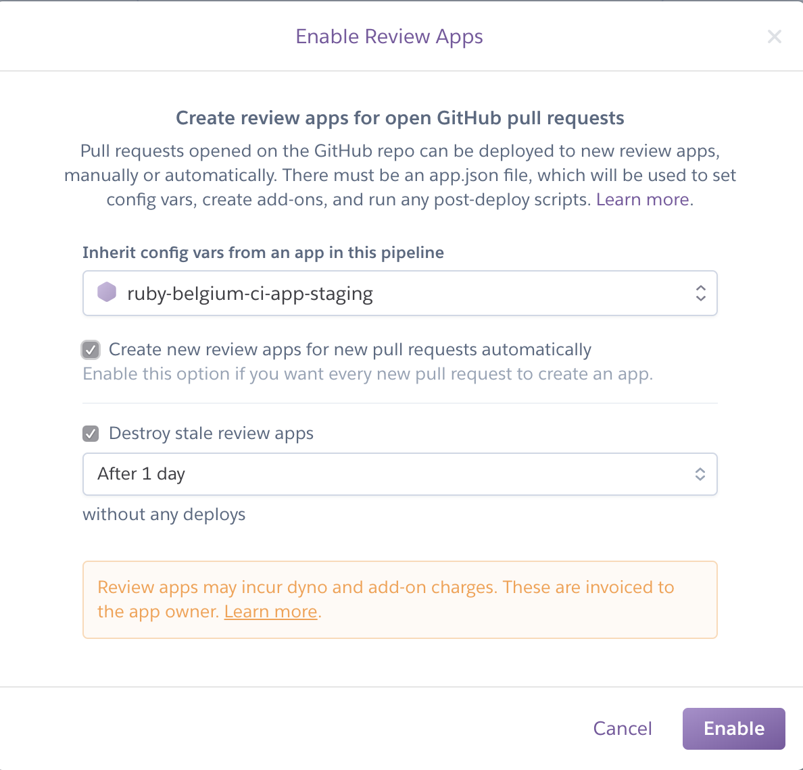
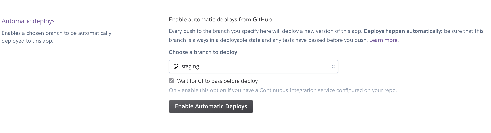
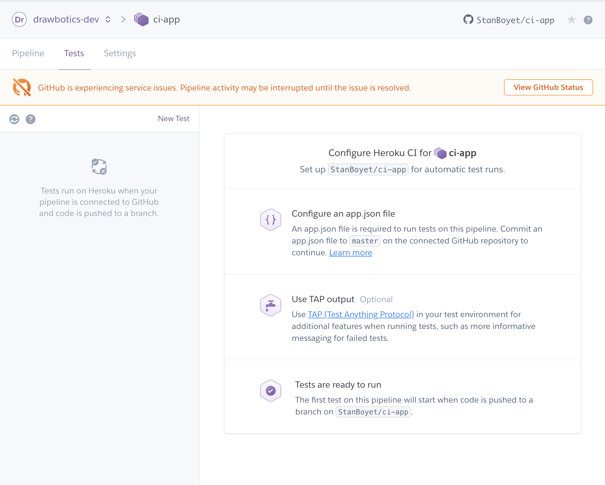
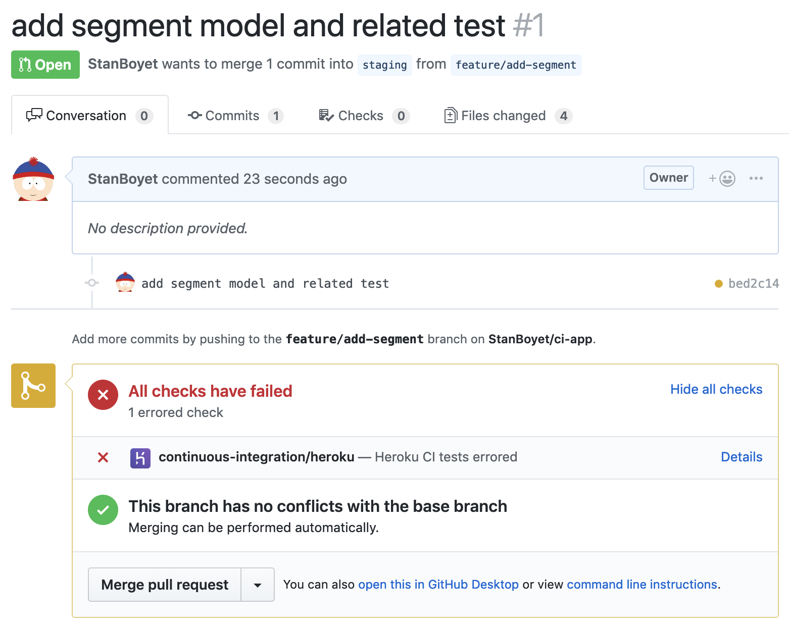

# Heroku CI

This app is meant to showcase how we can have an integrated Continuous Integration flow.

## Setting up the Pipeline

To setup your CI environment, let's create a `pipeline`.



## Review apps

A review app is an app that is going to be automatically generated and made available for each Pull Request you will open. This is a way for the team and most often the product owners to try a feature in the wild.

You enable a review app from a given parent, from which it will feed regarding environment variables



You will create an `app.json` file, which will serves as the backbone and config file for the deployment of your app.



## Setting up automatic deploys

In your `staging` (and maybe your `production` one, given how much you trust the process 🤞) app, under `Deploy`, you can setup `Automatic deploys`, which will deploy each commit pushed to the according branch to your app.



## Flow recap

The given flow for our deployment flow is:

```
          +--------------------+           +------------------------+
          |                    | git push  |                        |
   GIT    | locally            |+--------->| Github Pull Request    |
+ GITHUB  | Commit 'feature-#1'|           | Commit 'feature-#1'    |
          |                    |           |                        |
          +--------------------+           +----------+-------------+
                              automatic deploy        |
                 +------------------------------------+
                 |
    +------------|-----------------------------------------------------------+
                 |
                 v
          +------------+         +-------------+         +----------------+
          |            | merged  |             | merged  |                |
  HEROKU  | Review app |+------->| Staging app |+------->| Production app |
          | Feature #1 |   PR    | Feature #1  |   PR    | Feature #1     |
          |            |         |             |         |                |
          +------------+         +-------------+         +----------------+
```
(ASCII flow from [ASCII Flow](http://stable.ascii-flow.appspot.com))

What this means is, from our commit push to github and our PR creation, we will have a review app ongoing. If this PR is merged into staging, it will be deployed in our staging environment. And if everything goes according to plan and we merge on github our `staging` branch into `master`, we will end up with a production branch with our latest commits.

We will basically drive our entire infrastructure from our git repository, more or less. Does it sound dangerous? It should not, you should have faith in what you push to the github repo ;) But how can you have faith without... tests!

## Continuous Integration

To benefit from our test suite, let's condition our deployments from our test suite behind green. Let's enable our CI to run our tests automatically.



Now, everytime we push a commit, we will run our test suite.

If a test fails in a PR, we will get notified and the PR can be prevented from being merged.

